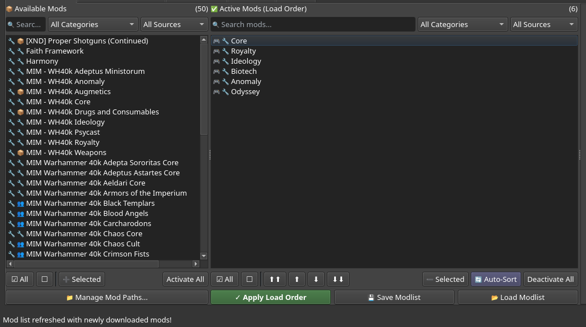
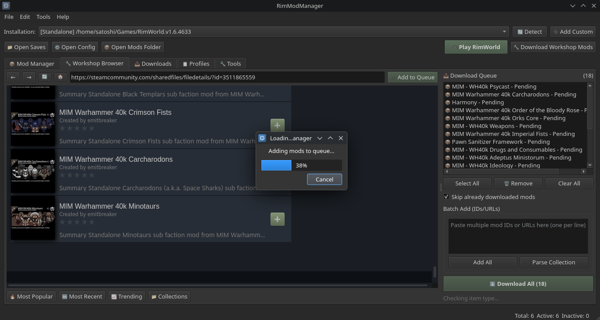
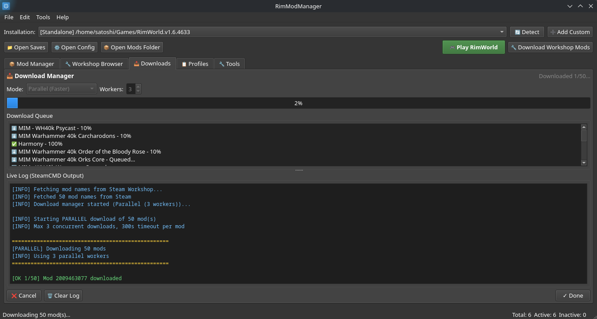
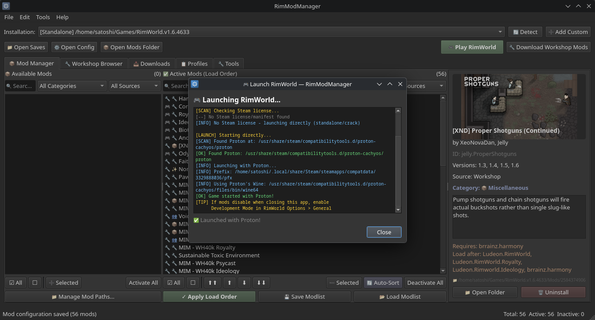
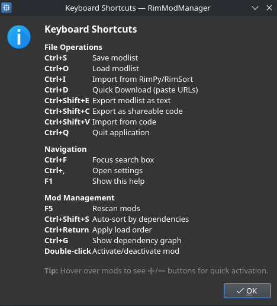

# RimModManager

<div align="center">

**The Ultimate Cross-Platform Mod Manager for RimWorld**

[](https://github.com/MrXploisLite/RimModManager/actions/workflows/ci.yml)
[](https://github.com/MrXploisLite/RimModManager/releases)
[](https://github.com/MrXploisLite/RimModManager/blob/main/LICENSE)
[](https://github.com/MrXploisLite/RimModManager/issues)
[](https://github.com/MrXploisLite/RimModManager/stargazers)
[](https://www.python.org/downloads/)
[](https://www.riverbankcomputing.com/software/pyqt/)
[](https://github.com/MrXploisLite/RimModManager)

[Features](#-features) • [Download](#-download) • [Installation](#-installation) • [Wiki](docs/WIKI.md) • [Contributing](#contributing)

</div>

---

## 🎯 Why RimModManager?

Managing 200+ RimWorld mods shouldn't be painful. RimModManager is a **free, open-source** mod manager that works on **any platform** and supports **any installation type** - Steam, GOG, Proton, Wine, Flatpak, or standalone.

- ✅ **No Steam required** - Works with cracked/standalone versions
- ✅ **Non-destructive** - Uses symlinks, never modifies your mods
- ✅ **Cross-platform** - Windows, macOS, Linux (including Steam Deck!)
- ✅ **Workshop downloads** - Download mods without owning the game on Steam
- ✅ **Conflict detection** - Know which mods break each other

---

## 📸 Screenshots

<details>
<summary><b>Click to view screenshots</b></summary>

### Mod Manager


### Workshop Browser


### Downloads


### Game Launcher


### Keyboard Shortcuts


</details>

---

## 📥 Download

**[⬇️ Download Latest Release](https://github.com/MrXploisLite/RimModManager/releases/latest)**

| Platform | File | Notes |
|----------|------|-------|
| 🪟 Windows | `RimModManager-Windows-x64.zip` | Extract and run |
| 🐧 Linux | `RimModManager-Linux-x64.tar.gz` | Extract and run |
| 🐧 Linux | `RimModManager-Linux-x64.deb` | `sudo dpkg -i *.deb` |
| 🍎 macOS | `RimModManager-macOS-x64.zip` | Extract and run |

---

## ✨ Features

<table>
<tr>
<td width="50%">

### 🎮 Universal Game Detection
- **Windows**: Steam, GOG, standalone
- **macOS**: Steam, GOG, standalone  
- **Linux**: Steam native, Proton, Flatpak, Wine, Lutris, Bottles

### 📦 Mod Management
- Drag-and-drop load order
- Symlink-based activation (non-destructive)
- Hover buttons (➕/➖) for quick toggle
- Search and filter mods
- Auto-sort by dependencies
- Uninstall mods safely

</td>
<td width="50%">

### 🔧 Workshop Integration
- Embedded Steam Workshop browser
- One-click download queue
- Parse entire Collections
- Batch downloads (single SteamCMD session)
- Check for mod updates
- View subscriber counts & ratings

### 📋 Profiles & Backups
- Save/load mod profiles
- Auto-backup before changes
- Import/export ModsConfig.xml
- Per-installation mod lists

</td>
</tr>
</table>

### 🛠️ Advanced Tools
| Tool | Description |
|------|-------------|
| **Update Checker** | Compare local mods vs Workshop versions |
| **Conflict Resolver** | Detect conflicts with fix suggestions |
| **Enhanced Info** | View Workshop stats (subs, favs, views) |
| **Smart Launcher** | Auto-detects Steam vs standalone |
| **Lightweight Mode** | Use system browser to save 100MB+ RAM |

---

## 🔨 Build from Source

You can build a standalone executable that doesn't require Python to run.

1. **Install Requirements**
   ```bash
   pip install pyinstaller
   ```

2. **Build**
   ```bash
   python build.py
   ```

3. **Result**
   The executable will be in the `dist/` folder.
   - **Size**: ~60-70MB (Lightweight)
   - **Compression**: Automatically uses UPX if installed
   - **Portable**: No installation required

---

## 🚀 Installation

### Quick Start
```bash
git clone https://github.com/MrXploisLite/RimModManager.git
cd RimModManager
pip install PyQt6
# Optional for embedded Workshop browser:
# pip install PyQt6-WebEngine
python main.py
```

<details>
<summary><b>📦 Windows Installation</b></summary>

```powershell
# Install Python from https://python.org
pip install PyQt6
# Optional for embedded Workshop browser:
# pip install PyQt6-WebEngine

# SteamCMD (for Workshop downloads)
# Option 1: Download from https://steamcdn-a.akamaihd.net/client/installer/steamcmd.zip
# Option 2: choco install steamcmd
```
</details>

<details>
<summary><b>🍎 macOS Installation</b></summary>

```bash
pip install PyQt6
# Optional for embedded Workshop browser:
# pip install PyQt6-WebEngine
brew install steamcmd
```
</details>

<details>
<summary><b>🐧 Linux Installation</b></summary>

**Arch / CachyOS / EndeavourOS / Manjaro:**
```bash
sudo pacman -S python python-pyqt6 python-pyqt6-webengine
yay -S steamcmd
```

**Ubuntu / Debian:**
```bash
pip install PyQt6
# Optional for embedded Workshop browser:
# pip install PyQt6-WebEngine
sudo apt install steamcmd
```

**Fedora:**
```bash
pip install PyQt6
# Optional for embedded Workshop browser:
# pip install PyQt6-WebEngine
sudo dnf install steamcmd
```
</details>

<details>
<summary><b>🎮 Steam Deck Installation</b></summary>

```bash
# Switch to Desktop Mode
# Open Konsole and run:
pip install --user PyQt6
# Optional for embedded Workshop browser:
# pip install --user PyQt6-WebEngine
git clone https://github.com/MrXploisLite/RimModManager.git
cd RimModManager
python main.py
```
</details>

---

## 📖 Usage

1. **Launch** RimModManager with `python main.py`
2. **Select** your RimWorld installation from dropdown
3. **Manage** mods with drag-and-drop or hover buttons
4. **Apply** changes with "Apply Load Order"
5. **Play** with the built-in launcher

### Config Locations
| Platform | Path |
|----------|------|
| Windows | `%APPDATA%/RimModManager/` |
| macOS | `~/Library/Application Support/RimModManager/` |
| Linux | `~/.config/rimmodmanager/` |

---

## 🔧 Troubleshooting

<details>
<summary><b>SteamCMD not found</b></summary>

| Platform | Solution |
|----------|----------|
| Windows | Download from [Steam](https://steamcdn-a.akamaihd.net/client/installer/steamcmd.zip) or `choco install steamcmd` |
| macOS | `brew install steamcmd` |
| Arch Linux | `yay -S steamcmd` |
| Ubuntu | `sudo apt install steamcmd` |
</details>

<details>
<summary><b>No installations detected</b></summary>

Click "➕ Add Custom" and browse to your RimWorld folder containing `RimWorldWin64.exe` or `RimWorldLinux`.
</details>

<details>
<summary><b>Mods not showing in game</b></summary>

1. Make sure you clicked "Apply Load Order"
2. Check if symlinks were created in your game's Mods folder
3. On Windows, you may need to run as Administrator for symlinks
</details>

---

## 🤝 Contributing

Contributions are welcome! See [CONTRIBUTING.md](CONTRIBUTING.md) for guidelines.

- 🐛 [Report bugs](https://github.com/MrXploisLite/RimModManager/issues/new?template=bug_report.md)
- 💡 [Request features](https://github.com/MrXploisLite/RimModManager/issues/new?template=feature_request.md)
- 🔧 [Submit PRs](https://github.com/MrXploisLite/RimModManager/pulls)

---

## 📜 License

**GPL-3.0 License** - See [LICENSE](LICENSE) for details.

If you fork or distribute this code, you must:
- Keep the source code open
- Include the original license
- State your changes
- Use GPL-3.0 license

---

<div align="center">

**⭐ Star this repo if you find it useful!**

</div>
